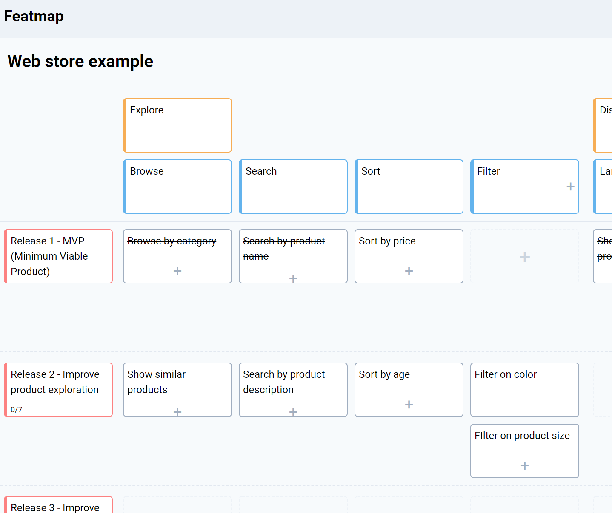

# Featmap, the perfect user story mapping tool

Built using React, Typescript and Golang. 

Featmap is a simple user story mapping tool for product managers to build, plan and communicate product backlogs.

#### See also 
[Frontend](https://www.github.com/amborle/featmap-client)

